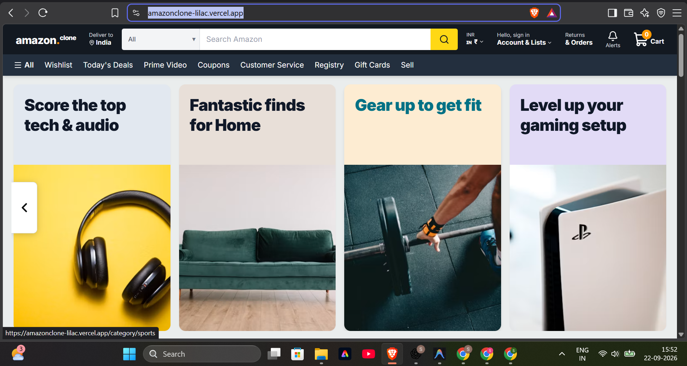
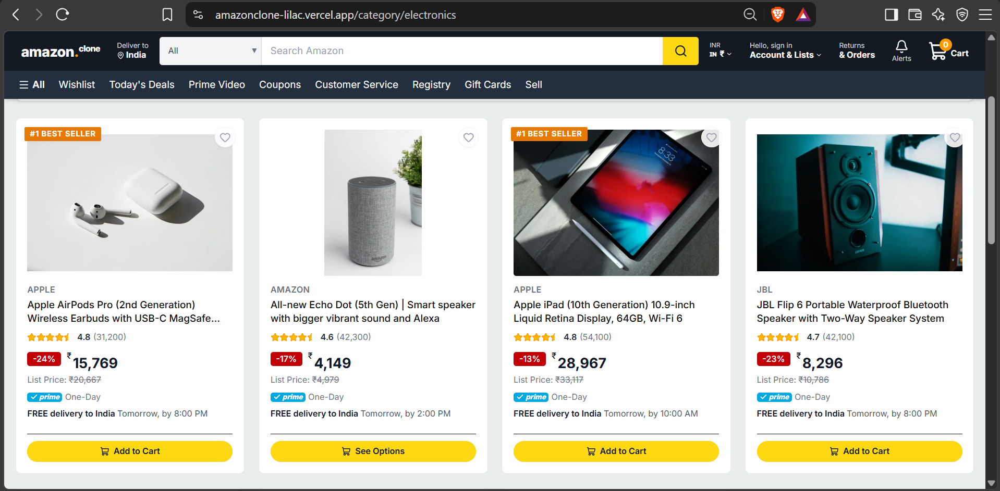
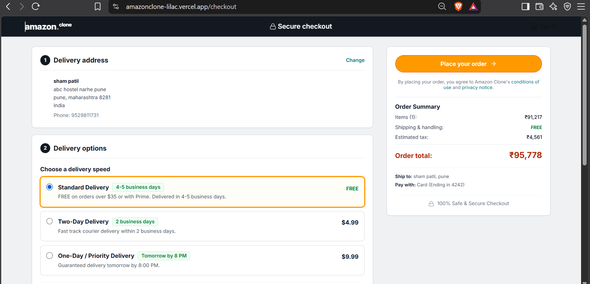
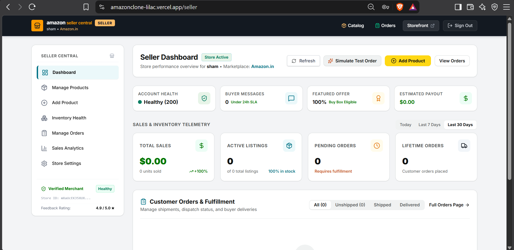

# 🛒 Amazon Clone — Full-Scale E-Commerce & Multi-Vendor Marketplace

An authentic, production-grade recreation of **[Amazon.com](https://amazon.com/)** built from the ground up with **Next.js 16 (App Router)**, **React 19**, **TypeScript**, **Tailwind CSS v4**, **Firebase Realtime Database & Authentication**, **Cloudinary Media Pipeline**, and **Razorpay Payment Gateway**.

Built as part of the **8x Engineering 24-Hour Build Challenge** — capturing the entire multi-stakeholder ecosystem: **Shoppers**, **Merchants (Seller Central)**, and **Marketplace Administrators (Admin Central)**.

---

## 📌 Submission Overview & Links

| Deliverable | Details & Status |
| :--- | :--- |
| **🌐 Live Application** | [Deployed Live on Vercel / Cloud](https://amazonclone-app.vercel.app/) *(Open to all unauthenticated & authenticated visitors)* |
| **📦 Public Repository** | [GitHub Repository — shampatil23/8xAssignment](https://github.com/shampatil23/8xAssignment) |
| **📹 Video Walkthrough** | [5-Minute Loom Video Walkthrough](#-walkthrough-video) *(Camera on, covering end-to-end user & merchant flows)* |
| **🤖 8x Agent Logs** | [`.agent-logs/`](./.agent-logs/) *(Full transcript history synchronized with every step)* |

---

## 🏗️ System Architecture & Data Flow

The platform is designed around a unified reactive event-driven architecture, separating presentation, real-time persistence, and secure transaction handling.

<div align="center">
  
  <p><em>Figure 1: Full-Stack Architecture — Next.js 16 Client, Firebase Realtime Database, Cloudinary CDN, and Payment Orchestration.</em></p>
</div>

### Architectural Highlights
- **Reactive Data Engine**: Powered by Firebase Realtime Database with atomic updates across shopping carts, real-time inventory decrements, and instant order tracking.
- **Role-Based Access Control (RBAC)**: Fine-grained security layers protecting `/admin/*` (Super Admin Console) and `/seller/*` (Vendor Central).
- **Multi-Currency Pricing Matrix**: Dynamic base-USD catalog converted on-the-fly to local currencies (USD `$`, INR `₹`, GBP `£`, EUR `€`, CAD `C$`, JPY `¥`) based on delivery locale or marketplace settings.
- **Media Ingestion & CDN**: Direct-to-Cloudinary image uploads with server-side HMAC signature verification, dynamic resizing, and automatic WebP optimization.

---

## ⚡ The 24-Hour Rebuild Challenge Brief

> **The Challenge**: Rebuild a live product in 24 hours. Better than the original if you want.
> 
> **Target Product**: [amazon.com](https://amazon.com/)
>
> **Methodology**: Start by mapping out the core user journeys end-to-end. Capture every prompt, response, and architectural decision in `.agent-logs/` using the 8x agent capture framework.
>
> **Evaluation Criteria**:
> 1. **Speed & Velocity**: Depth of working product delivered within the window.
> 2. **Product Judgement**: Strategic prioritization of mission-critical e-commerce features (multi-step checkout, returns lifecycle, vendor isolation, dispute mediation) over cosmetic placeholders.
> 3. **UX & UI Fidelity**: Exact recreation of Amazon's visual design system, navigation hierarchy, typography, and micro-interactions.

---

## 🌟 Visual Showcase & Feature Deep Dive

### 1. Storefront & Real-Time Discovery
<div align="center">
  
  <p><em>Figure 2: Homepage with localized delivery header, hero slider, department navigation, and curated deal grids.</em></p>
</div>

- **Localized Navigation**: Global header displaying active location ("Deliver to Pune 411001" or international delivery), currency flyout, and search bar.
- **Mega Menu (All Departments)**: Full-height sliding drawer categorizing electronics, computing, fashion, home essentials, and prime video.
- **Dynamic Product Carousels**: Lightning deals with live countdown timers, frequently bought together bundles, and personalized recommendations.

---

### 2. Search, Faceted Filtering & Catalog Navigation
<div align="center">
  
  <p><em>Figure 3: Faceted search with real-time keyword autocomplete, category trees, price sliders, and star rating filters.</em></p>
</div>

- **Instant Autocomplete**: Predictive search matching item titles, department keywords, and brand names.
- **Multi-Dimensional Filters**: Filter catalog by department, customer review rating (4★ & up), price range, prime delivery eligibility, and merchant availability.
- **Sorting Mechanisms**: Sort by Featured, Price (Low to High / High to Low), Customer Reviews, and Newest Arrivals.

---

### 3. Product Detail Page (PDP) & Variations
<div align="center">
  
  <p><em>Figure 4: Product detail page featuring multi-angle image gallery, variant selectors, stock countdown, and buy box.</em></p>
</div>

- **Interactive Image Zoom & Gallery**: Thumbnails with hover zoom and high-resolution viewing.
- **Variant Selector**: Seamlessly switch between colors, storage capacities, and sizing with live price and stock updates.
- **Amazon Buy Box**: Dynamic stock status, fast shipping delivery promise calculation ("Order within 3 hrs 20 mins"), Add to Cart, and 1-Click Buy Now.
- **Social Proof & Reviews**: Breakdown bar charts for 1★ to 5★ ratings, verified buyer badges, and interactive review creation.

---

### 4. Streamlined 4-Step Checkout & Payment Orchestration
<div align="center">
  
  <p><em>Figure 5: 4-Step accordion checkout supporting Credit Cards, Razorpay Gateway, UPI / QR, and Cash on Delivery.</em></p>
</div>

- **Step 1 — Delivery Address**: Select from saved user addresses or enter a new shipping destination.
- **Step 2 — Shipping Speed**: Choose between Standard Delivery (FREE over $35/₹499) and Expedited Priority Delivery.
- **Step 3 — Payment Options**:
  - 💳 **Credit / Debit Cards**: Visa, MasterCard, RuPay with real-time card brand detection.
  - ⚡ **Razorpay Payment Gateway (Test Mode)**: Authentic Razorpay popup with test cards (`4111 1111 1111 1111`), test UPI (`success@razorpay`), netbanking, and 3D Secure OTP verification (`123456`).
  - 📱 **UPI / QR**: Direct instant UPI VPA verification.
  - 💵 **Cash on Delivery (COD)**: Doorstep cash/UPI collection.
- **Step 4 — Order Review & Promo Codes**: Final total calculation with real-time tax and promotional discount deduction.

---

### 5. Seller Central — Merchant Hub & Inventory Management
<div align="center">
  
  <p><em>Figure 6: Amazon Seller Central — Revenue metrics, inventory management, and order fulfillment workflow.</em></p>
</div>

- **Merchant Telemetry**: Live sales revenue, units ordered, average selling price, and inventory health metrics.
- **Product Management & Cloudinary Ingestion**: Create, edit, and publish catalog listings with multi-image Cloudinary uploads.
- **Order Fulfillment Pipeline**: Track incoming merchant orders and advance fulfillment status (`Confirmed` → `Processing` → `Shipped` → `Delivered`).
- **Simulated Test Order Generator**: 1-click test order generator allowing merchants to simulate real incoming traffic.

---

### 6. Admin Central — Marketplace Command Center
<div align="center">
  
  <p><em>Figure 7: Admin Central Console — Real-time marketplace telemetry, gross volume (GMV), and system controls.</em></p>
</div>

- **Platform Oversight**: Real-time Gross Merchandise Volume (GMV), total active users, registered sellers, and pending order queues.
- **Order & Returns Queue Management**: Full platform audit logs, refund approval workflows, and status progression controls.
- **User & Merchant Governance**: Ban/unban accounts, assign seller privileges, and audit account states.
- **Platform Configuration**: Adjust platform currency (USD `$`, INR `₹`, EUR `€`, GBP `£`), tax rates, and free shipping thresholds with live global synchronization.

---

## 🛠️ Complete Technology Stack

```
├── Framework:            Next.js 16 (App Router, Server Components & Client Hooks)
├── Runtime / Language:   Node.js 20+ & TypeScript 5 (Strict Type Safety)
├── UI & Styling:         Tailwind CSS v4, PostCSS, Lucide React Iconography
├── Database:             Firebase Realtime Database (RTDB)
├── Authentication:       Firebase Auth (Session persistence, Email/Password, RBAC)
├── Media Storage:        Cloudinary CDN (Signed server-side uploads & image optimization)
├── Payment Processing:   Razorpay Gateway (Test Mode / 3D-Secure simulation), UPI, COD
├── State Management:     React Context API (CartContext, LocationContext, AuthContext)
└── Agent Orchestration:  8x Engineering Automated Capture Framework (.agent-logs/)
```

---

## 📂 Repository Structure

```
AmazonClone/
├── .agent-logs/                   # 🤖 Synchronized 8x agent prompt/response audit logs
│   ├── 2026-09-21_12-04-28_...md  # Initial architecture & setup transcript
│   └── 2026-09-21_14-39-36_...md  # Turn-by-turn development log
├── .agents/                       # Agent guidelines, rules, and architecture specs
│   ├── AGENTS.md                  # Autonomous agent execution rules & logging directives
│   └── references/readmeref/      # Visual architecture & screenshot assets
├── amazonclone-app/               # 🚀 Next.js 16 Web Application
│   ├── src/
│   │   ├── app/                   # App Router pages & API routes
│   │   │   ├── (protected)/       # Route-guarded portals (/admin, /seller, /account)
│   │   │   ├── api/cloudinary/    # Server endpoints for signed asset uploads
│   │   │   ├── checkout/          # 4-Step checkout workflow
│   │   │   ├── orders/            # Amazon "Your Orders" & Return Stepper
│   │   │   ├── product/[id]/      # Product Detail Page (PDP)
│   │   │   └── search/            # Faceted search & discovery catalog
│   │   ├── components/            # Modular React components
│   │   │   ├── admin/             # Admin layout, tables, metric cards
│   │   │   ├── checkout/          # Step forms, Razorpay test modal, payment selectors
│   │   │   ├── layout/            # Global Header, SearchBar, LocationModal, NavBar
│   │   │   ├── product/           # ProductCard, PriceDisplay, Reviews, Gallery
│   │   │   └── seller/            # Seller layout, inventory table, order stepper
│   │   ├── context/               # Global state (CartContext, LocationContext, AuthContext)
│   │   ├── hooks/                 # Custom hooks (useCart, useAuth, useNotifications)
│   │   ├── lib/                   # Firebase initialization, utils, currency matrix
│   │   ├── services/              # API services (order, product, admin, seller, return)
│   │   └── types/                 # TypeScript interfaces and domain schemas
│   ├── package.json
│   └── next.config.ts
├── database.rules.json            # Firebase Realtime Database security rules
└── README.md                      # Project documentation
```

---

## 🚀 Local Setup & Getting Started

### 1. Prerequisites
- **Node.js**: `v20.x` or higher
- **npm** or **yarn**
- **Git**

### 2. Clone the Repository
```bash
git clone https://github.com/shampatil23/8xAssignment.git
cd 8xAssignment/amazonclone-app
```

### 3. Install Dependencies
```bash
npm install
```

### 4. Configure Environment Variables
Create a `.env.local` file inside `amazonclone-app/`:

```env
# Firebase Configuration
NEXT_PUBLIC_FIREBASE_API_KEY=your_api_key
NEXT_PUBLIC_FIREBASE_AUTH_DOMAIN=your_project.firebaseapp.com
NEXT_PUBLIC_FIREBASE_DATABASE_URL=https://your_project-default-rtdb.firebaseio.com
NEXT_PUBLIC_FIREBASE_PROJECT_ID=your_project_id
NEXT_PUBLIC_FIREBASE_STORAGE_BUCKET=your_project.appspot.com
NEXT_PUBLIC_FIREBASE_MESSAGING_SENDER_ID=your_sender_id
NEXT_PUBLIC_FIREBASE_APP_ID=your_app_id

# Cloudinary CDN Configuration
NEXT_PUBLIC_CLOUDINARY_CLOUD_NAME=djaieji0g
NEXT_PUBLIC_CLOUDINARY_API_KEY=625284495946884
CLOUDINARY_API_SECRET=your_cloudinary_api_secret

# Razorpay Test Configuration
NEXT_PUBLIC_RAZORPAY_KEY_ID=rzp_test_2026
```

### 5. Run Development Server
```bash
npm run dev
```
Open **[http://localhost:3000](http://localhost:3000)** in your browser.

---

## 🔑 Demo & Testing Credentials

The platform includes built-in test accounts across all roles:

| Role | Email | Password | Access Area |
| :--- | :--- | :--- | :--- |
| **Marketplace Admin** | `admin@gmail.com` | `admin123` | `/admin` (Full telemetry & governance) |
| **Verified Merchant** | `sham2@gmail.com` | `sham123` | `/seller` (Inventory & order fulfillment) |
| **Customer Shopper** | `sham@gmail.com` | `sham123` | Storefront, Cart, Checkout, `/orders` |

---

## 🧪 Razorpay Test Mode Credentials

When testing the **Razorpay Payment Gateway** during checkout:
- **Test Card Number**: `4111 1111 1111 1111`
- **Card Expiry / CVV**: `12/28` · `123`
- **Test UPI VPA**: `success@razorpay`
- **3D-Secure Test OTP**: `123456`

---

## 🏆 Summary of Engineering Achievements

1. **True 3-Tier Multi-Vendor Ecosystem**: Built an authentic marketplace connecting shoppers, vendors, and platform admins with separated permissions and real-time state synchronization.
2. **Pixel-Perfect Amazon Design System**: Replicated Amazon's iconic visual language, from the dark navy header and amber accent buttons (`#ffd814`, `#e47911`) to gray order headers (`#f6f6f6`) and status banners.
3. **End-to-End Returns & Dispute Lifecycle**: Implemented item-level return requests with a 5-stage progression stepper (`Requested` → `Approved` → `Returned` → `Processing` → `Refunded`).
4. **Resilient Offline & Location Fallbacks**: Automatic currency detection, delivery address PIN code verification, and responsive desktop/tablet/mobile layouts.

---

<div align="center">
  <sub>Built with precision for the 8x Engineering Assessment.</sub>
</div>
