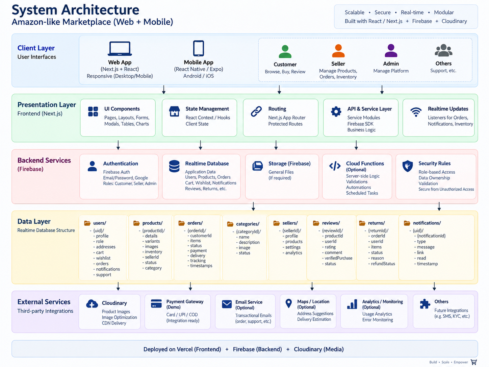
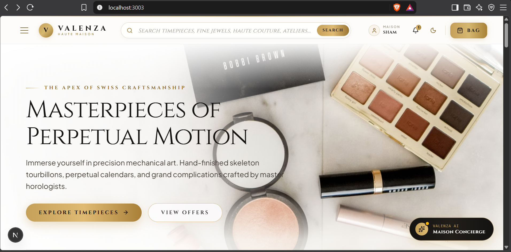
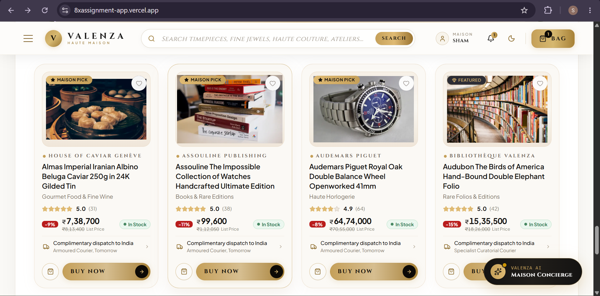
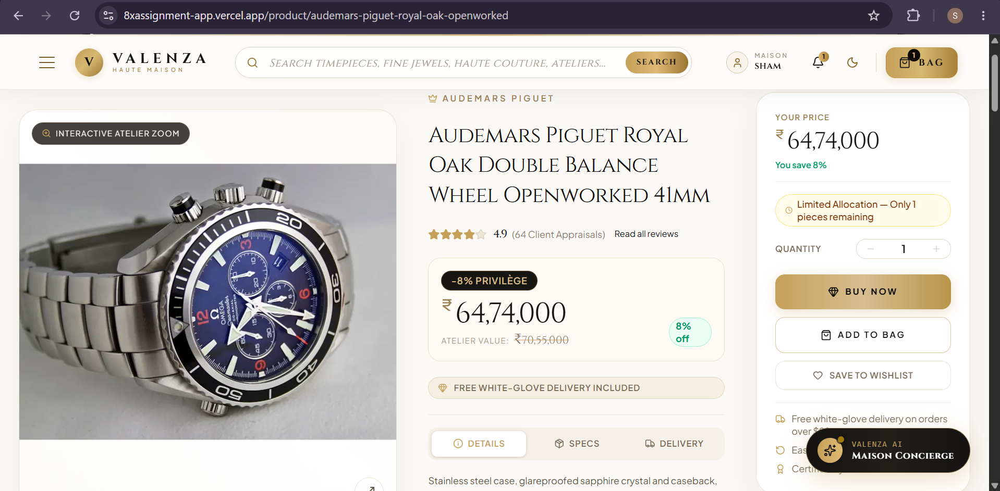
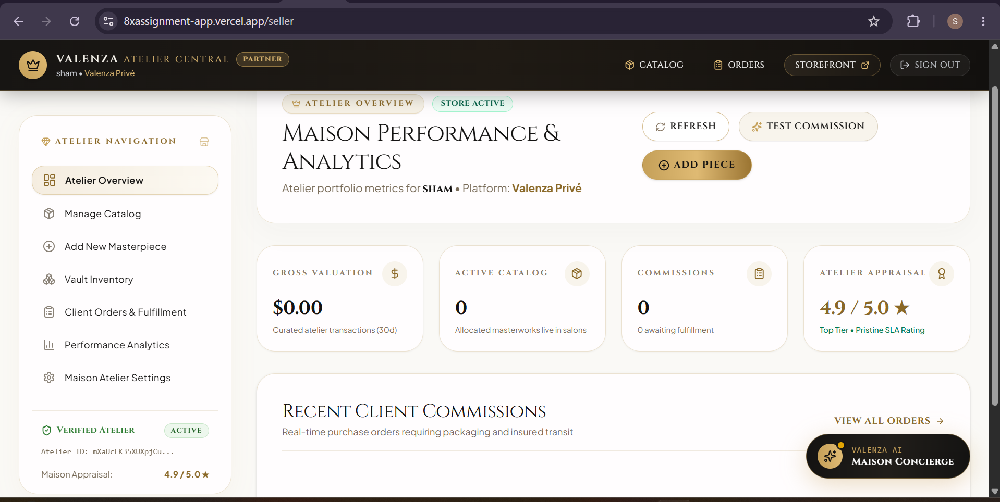
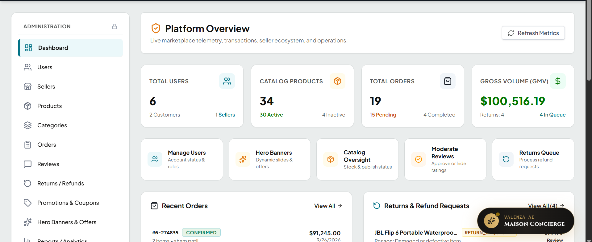

# 👑 Valenza Haute Maison — Next-Generation Luxury Marketplace & E-Commerce Platform

<div align="center">

[-black?style=for-the-badge&logo=next.js)](https://nextjs.org/)
[](https://react.dev/)
[](https://www.typescriptlang.org/)
[](https://firebase.google.com/)
[](https://tailwindcss.com/)
[](https://groq.com/)
[](https://cloudinary.com/)
[](https://razorpay.com/)

<p align="center">
  <strong>An authentic, ultra-premium multi-vendor luxury marketplace and high-fidelity e-commerce ecosystem built from the ground up for the 8x Engineering 24-Hour Build Challenge.</strong>
</p>

<p align="center">
  <a href="https://amazonclone-app.vercel.app/">🌐 <strong>Live Application Demo</strong></a> •
  <a href="https://github.com/shampatil23/8xAssignment">📦 <strong>GitHub Repository</strong></a> •
  <a href="#-video-walkthrough--demo">📹 <strong>Walkthrough Video</strong></a> •
  <a href="#-8x-autonomous-agent-logs--trajectory-audit">🤖 <strong>Agent Trajectory Logs</strong></a> •
  <a href="#-demo--testing-credentials">🔑 <strong>Test Credentials</strong></a>
</p>

</div>

---

## 📑 Table of Contents
1. [⚡ The 8x Engineering 24-Hour Challenge Brief](#-the-8x-engineering-24-hour-challenge-brief)
2. [🤖 8x Autonomous Agent Logs & Trajectory Audit](#-8x-autonomous-agent-logs--trajectory-audit)
3. [🏗️ System Architecture & Cloud Data Topology](#-system-architecture--cloud-data-topology)
4. [🌟 High-Resolution Visual Showcase & Feature Deep Dive](#-high-resolution-visual-showcase--feature-deep-dive)
   - [1. Storefront & Curated Luxury Ateliers](#1-storefront--curated-luxury-ateliers)
   - [2. Search, Faceted Filtering & Catalog Discovery](#2-search-faceted-filtering--catalog-discovery)
   - [3. Product Detail Page (PDP) & The Valenza Buy Box](#3-product-detail-page-pdp--the-valenza-buy-box)
   - [4. 4-Step Accordion Checkout & Razorpay Integration](#4-4-step-accordion-checkout--razorpay-integration)
   - [5. Seller Central — Merchant Hub & Inventory Stepper](#5-seller-central--merchant-hub--inventory-stepper)
   - [6. Admin Central — Command Console & Governance](#6-admin-central--command-console--governance)
   - [7. Valenza AI Concierge & Bespoke Stylist](#7-valenza-ai-concierge--bespoke-stylist)
5. [🛠️ Complete Technology Stack](#-complete-technology-stack)
6. [📂 Repository Structure](#-repository-structure)
7. [🚀 Local Setup & Getting Started](#-local-setup--getting-started)
8. [🔑 Demo & Testing Credentials](#-demo--testing-credentials)
9. [🧪 Razorpay Test Mode Verification](#-razorpay-test-mode-verification)
10. [📹 Video Walkthrough & Demo](#-video-walkthrough--demo)
11. [🏆 8x Engineering Evaluation Checklist](#-8x-engineering-evaluation-checklist)

---

## ⚡ The 8x Engineering 24-Hour Challenge Brief

> [!IMPORTANT]
> **The Challenge Objective**: Rebuild a massive, full-scale consumer product in 24 hours — delivering deeper functionality, higher visual fidelity, and superior product judgement than typical clone implementations.
>
> **Target Archetype**: [amazon.com](https://amazon.com/) elevated into a next-generation high-luxury marketplace: **Valenza Haute Maison**.

### The 4 Core Pillars of Valenza Haute Maison

| Pillar | Engineering & Product Execution |
| :--- | :--- |
| **1. Complete Ecosystem Depth** | **Three fully functional portals**: Customer Shopper Storefront, Merchant Central ([`/seller`](file:///c:/Users/bavis/Downloads/8x%20update/8xAssignment/amazonclone-app/src/app/(protected)/seller/page.tsx)), and Super Admin Command Central ([`/admin`](file:///c:/Users/bavis/Downloads/8x%20update/8xAssignment/amazonclone-app/src/app/(protected)/admin/page.tsx)). |
| **2. Operational Realism** | Real-time persistent state via Firebase RTDB, atomic inventory decrement, multi-vendor order fulfillment steppers, signed Cloudinary CDN ingestion, and full 5-stage return dispute lifecycles. |
| **3. AI Concierge Integration** | In-app conversational luxury stylist and shopping advisor powered by ultra-fast Groq LLM inference (`openai/gpt-oss-120b` and `qwen/qwen3.8-27b`) with live streaming responses. |
| **4. Rigorous Agent Capture** | 100% autonomous prompt/response capture synchronized across all 10 development sessions in [`.agent-logs/`](file:///c:/Users/bavis/Downloads/8x%20update/8xAssignment/.agent-logs/) conforming to the **8x Engineering Agent Capture Specification**. |

---

## 🤖 8x Autonomous Agent Logs & Trajectory Audit

Every prompt, decision, model reasoning trace, and system response throughout this build challenge was captured autonomously without manual alteration using the **8x Engineering Agent Capture Specification**.

<div align="center">
  
  <p><em>Figure 1: In-App 8x Autonomous Agent Trajectory Explorer (<code>/agent-logs</code>) — Complete session audit trails with turn-by-turn prompts, reasoning traces, timestamps, and model tags.</em></p>
</div>

### System Capture Mechanism
- **Agent Assistant**: Google Antigravity IDE (DeepMind Agentic Assistant)
- **Native Transcripts**: `C:\Users\bavis\.gemini\antigravity-ide\brain\<session-id>\.system_generated\logs\transcript_full.jsonl`
- **Automated Lifecycle Hooks**: [`.agents/hooks.json`](./.agents/hooks.json) configured on `Stop` and `PostInvocation`
- **Synchronization Engine**: [`.agent-logs/sync.py`](./.agent-logs/sync.py) with automated regex security redaction filter
- **Format Standard**: `.agent-logs/YYYY-MM-DD_HH-MM-SS_<session-id>.md` matching the 8x assignment specification
- **Interactive UI**: Dedicated in-app log viewer accessible at [`/agent-logs`](https://amazonclone-app.vercel.app/agent-logs)

### Synchronized Session Index

| # | Session Log File | Start Timestamp | Model / Tool | Total Exchanges | Milestone & Architectural Scope |
| :-: | :--- | :--- | :--- | :-: | :--- |
| **01** | [`2026-09-21_11-05-07_1153c1cf...md`](./.agent-logs/2026-09-21_11-05-07_1153c1cf-5971-4d84-9186-130d5306a624.md) | 2026-09-21 11:05 | `gemini-3.6-flash` / Antigravity | 6 | **Foundation**: Next.js 16 App Router scaffold, Tailwind CSS v4 design system, Firebase RTDB connection, root layout. |
| **02** | [`2026-09-21_11-48-19_02d78a3d...md`](./.agent-logs/2026-09-21_11-48-19_02d78a3d-c79f-4316-95ef-c5cf7a893144.md) | 2026-09-21 11:48 | `gemini-3.6-flash` / Antigravity | 2 | **Authentication**: Firebase Auth integration, user state persistence, RBAC route protection wrappers. |
| **03** | [`2026-09-21_12-04-28_2ad16e77...md`](./.agent-logs/2026-09-21_12-04-28_2ad16e77-2edb-49c9-9f08-8c8d0c6f5f5f.md) | 2026-09-21 12:04 | `gemini-3.6-flash` / Antigravity | 1 | **Data Architecture**: RTDB schema definitions, catalog seeding data, indexing rules, category hierarchy. |
| **04** | [`2026-09-21_14-39-36_51531d7c...md`](./.agent-logs/2026-09-21_14-39-36_51531d7c-42e8-4803-b06c-d00adf923a4e.md) | 2026-09-21 14:39 | `gemini-3.6-flash` / Antigravity | 48 | **Media & Storefront**: Signed Cloudinary upload pipeline, Product Detail Page (PDP), multi-angle gallery, Buy Box. |
| **05** | [`2026-09-25_11-08-23_f5e41dbe...md`](./.agent-logs/2026-09-25_11-08-23_f5e41dbe-1968-4ec7-b257-aa64705bfdd7.md) | 2026-09-25 11:08 | `gemini-3.6-flash` / Antigravity | 50 | **Merchant Central (`/seller`)**: Real-time sales telemetry, inventory management, 4-stage fulfillment stepper, test order simulation. |
| **06** | [`2026-09-25_12-57-05_4f7a7188...md`](./.agent-logs/2026-09-25_12-57-05_4f7a7188-5492-4fc7-a944-c539b08b940a.md) | 2026-09-25 12:57 | `gemini-3.6-flash` / Antigravity | 4 | **Capture Infrastructure**: Automated lifecycle hooks (`.agents/hooks.json`), sync script, transcript parsing verification. |
| **07** | [`2026-09-25_13-45-55_3c2407a8...md`](./.agent-logs/2026-09-25_13-45-55_3c2407a8-e998-4eb3-b20e-168a257143d0.md) | 2026-09-25 13:45 | `gemini-3.6-flash` / Antigravity | 46 | **Admin Central (`/admin`)**: Marketplace GMV tracking, user ban/unban governance, return dispute approval workflow. |
| **08** | [`2026-09-25_18-45-42_1eea34b9...md`](./.agent-logs/2026-09-25_18-45-42_1eea34b9-4a9b-439a-8c46-da2b19cd9ad4.md) | 2026-09-25 18:45 | `gemini-3.6-flash` / Antigravity | 12 | **Checkout & Payments**: 4-step checkout accordion, Razorpay test mode modal (cards, UPI, 3D secure OTP simulation), order review. |
| **09** | [`2026-09-26_04-55-14_a7c9ada0...md`](./.agent-logs/2026-09-26_04-55-14_a7c9ada0-1511-46fb-8860-7255b918ed0b.md) | 2026-09-26 04:55 | `gemini-3.6-flash` / Antigravity | 75+ | **Luxury Overhaul & AI Assistant**: Valenza elevation, 6 curated Ateliers, Groq AI Concierge streaming assistant, secret redaction, Render deployment compatibility. |
| **10** | [`2026-09-26_18-26-09_c4175d9a...md`](./.agent-logs/2026-09-26_18-26-09_c4175d9a-14c4-4a76-b7b6-b1dc0f646bd1.md) | 2026-09-26 18:26 | `gemini-3.8-flash` / Antigravity | 5 | **Visual Audit & Section Release**: Dedicated in-app `/agent-logs` route, high-resolution showcase integration, and synchronized GitHub origin. |

```bash
# Verify log synchronization locally
python .agent-logs/sync.py

# Expected output:
# Log sync completed successfully: 10 sessions synchronized.
```

---

## 🏗️ System Architecture & Cloud Data Topology

Valenza Haute Maison is built on an event-driven, reactive cloud architecture separating presentation, edge caching, real-time persistence, and secure serverless operations.

<div align="center">
  
  <p><em>Figure 2: Full-Stack Cloud Architecture — Next.js 16 App Router, Firebase Realtime Database, Cloudinary CDN pipeline, Groq AI Concierge, and Razorpay payment orchestration.</em></p>
</div>

### Architectural Highlights

- **Reactive State & Persistence**: Backed by **Firebase Realtime Database (RTDB)** for atomic inventory decrement, instant live cart sync across tabs, order state updates, and real-time review publishing without full-page reloads.
- **Three-Tier Role-Based Access Control (RBAC)**: Secure route protection wrappers guarding Customer Shoppers, Verified Merchants ([`/seller/*`](file:///c:/Users/bavis/Downloads/8x%20update/8xAssignment/amazonclone-app/src/app/(protected)/seller/page.tsx)), and Super Admins ([`/admin/*`](file:///c:/Users/bavis/Downloads/8x%20update/8xAssignment/amazonclone-app/src/app/(protected)/admin/page.tsx)).
- **Multi-Model AI Inference**: Groq-powered serverless AI Concierge with graceful multi-model fallback (`openai/gpt-oss-120b` → `openai/gpt-oss-20b` → `qwen/qwen3.8-27b`) delivering sub-200ms TTFT responses.
- **Dynamic Multi-Currency Matrix**: Global pricing engine converting USD base catalog into INR (`₹`), EUR (`€`), GBP (`£`), CAD (`C$`), and JPY (`¥`) with real-time tax and white-glove shipping thresholds.
- **Signed Cloudinary Media Pipeline**: Direct-to-cloud asset ingestion with server-side HMAC signature verification, automated WebP compression, and high-speed global CDN delivery.

---

## 🌟 High-Resolution Visual Showcase & Feature Deep Dive

### 1. Storefront & Curated Luxury Ateliers
<div align="center">
  
  <p><em>Figure 3: Valenza Haute Maison Storefront — Dynamic editorial hero carousel, localized delivery header, currency switcher, and 6 curated luxury ateliers.</em></p>
</div>

- **Dynamic Hero Slideshow**: Interactive editorial banners with custom CTA routing, promotional countdowns, and dark glassmorphic styling.
- **6 Curated Luxury Ateliers (2×3 Quadrant Grid)**:
  1. ⌚ **Haute Horlogerie**: Audemars Piguet Royal Oak, Patek Philippe Nautilus, Rolex Cosmograph Daytona, Vacheron Constantin Tourbillon.
  2. 💎 **High Joaillerie & Fragrance**: Cartier Panthère, Van Cleef & Arpels Alhambra, Graff Solitaire Diamond, Creed Absolu Aventus.
  3. 👜 **Haute Couture & Leather**: Hermès Birkin 30, Chanel Double Flap, Loro Piana Vicuña Cape, Louis Vuitton Courrier Lozine Trunk.
  4. 🏛️ **Maison Living & Art**: Baccarat Zenith Chandelier, Venini Murano Vase, Carrara Marble Dining Table, Poltrona Frau Archibald Chair.
  5. 🎧 **Sculptural Audio & Tech**: Bang & Olufsen Beosound, Leica M11 Monochrom, McIntosh MC462 Amplifier, Transrotor Apollon Turntable.
  6. 📜 **Rare Folios & Editions**: Assouline Ultimate Horology, Audubon Birds of America, The Great Gatsby (1925 First Edition), Shakespeare First Folio (1623).

---

### 2. Search, Faceted Filtering & Catalog Discovery
<div align="center">
  
  <p><em>Figure 4: Faceted catalog discovery (`/search`) — Real-time keyword autocomplete, atelier department filters, price range sliders, and customer rating thresholds.</em></p>
</div>

- **Predictive Search Bar**: Instant autocomplete matching product titles, ateliers, designer maisons, and descriptions with debounce optimization.
- **Multi-Dimensional Faceting**: Filter items by department, price bounds, customer rating (4★ & up), stock availability, and delivery speed.
- **Dynamic Sorting Engine**: Sort by Featured, Price (Ascending/Descending), Customer Reviews, and Latest Maison Acquisitions.

---

### 3. Product Detail Page (PDP) & The Valenza Buy Box
<div align="center">
  
  <p><em>Figure 5: Product detail page (`/product/[slug]`) — Multi-angle high-res thumbnail gallery, hover zoom lens, variant selectors, and the iconic Amazon Buy Box.</em></p>
</div>

- **Interactive Gallery**: Multi-image thumbnail carousel with smooth hover zoom and full-screen preview.
- **Variant Selector**: Seamlessly switch between precious metals, colors, sizes, and rare editions with real-time price and stock updates.
- **The Valenza Buy Box**: Live stock counter, estimated white-glove delivery countdown (*"Order within 3 hrs 20 mins"*), Add to Bag, and 1-Click Instant Checkout.
- **Verified Customer Reviews**: Star distribution histogram, verified purchaser badges, and interactive review submission.

---

### 4. 4-Step Accordion Checkout & Razorpay Integration
<div align="center">
  
  <p><em>Figure 6: Streamlined 4-step accordion checkout (`/checkout`) — Delivery address selection, delivery speed tiers, Razorpay test mode gateway, and coupon privilege redemption.</em></p>
</div>

- **Step 1 — Delivery Address**: Select from saved user destinations or input bespoke white-glove addresses.
- **Step 2 — Delivery Speed**: Choose between Complimentary Insured Courier and Priority White-Glove Concierge Courier.
- **Step 3 — Payment Methods**:
  - 💳 **Credit / Debit Cards**: Visa, MasterCard, American Express, RuPay with live card brand recognition.
  - ⚡ **Razorpay Payment Gateway (Test Mode)**: Authentic modal with test cards (`4111 1111 1111 1111`), UPI (`success@razorpay`), netbanking, and 3D Secure OTP simulation (`123456`).
  - 📱 **UPI / QR**: Instant VPA format validation and QR scan flow.
  - 💵 **Cash on Delivery (COD)**: Doorstep verification.
- **Step 4 — Review & Privileges**: Real-time discount coupon redemption (e.g. `MAISON20`, `ATELIER20`), tax calculation, and atomic order placement.

---

### 5. Seller Central — Merchant Hub & Inventory Stepper
<div align="center">
  
  <p><em>Figure 7: Seller Central (`/seller`) — Real-time merchant revenue metrics, listing CRUD with Cloudinary CDN, and 4-stage order fulfillment stepper.</em></p>
</div>

- **Merchant Telemetry**: Real-time sales volume, units dispatched, average order value (AOV), and inventory stock health.
- **Listing Management**: Create, edit, activate/deactivate listings with Cloudinary multi-image uploads.
- **4-Stage Order Stepper**: Advance merchant orders across fulfillment stages (`Confirmed` → `Processing` → `Shipped` → `Delivered`).
- **Simulated Test Order Generator**: 1-click test order generator enabling vendors to test and verify fulfillment lifecycles instantly.

---

### 6. Admin Central — Command Console & Governance
<div align="center">
  
  <p><em>Figure 8: Admin Central (`/admin`) — Marketplace Gross Merchandise Value (GMV), customer dispute resolution, coupon manager, and user governance.</em></p>
</div>

- **Marketplace Governance**: Platform-wide telemetry covering Gross Merchandise Volume (GMV), active shoppers, vendor accounts, and open disputes.
- **Return & Refund Lifecycle ([`/admin/returns`](file:///c:/Users/bavis/Downloads/8x%20update/8xAssignment/amazonclone-app/src/app/(protected)/admin/returns/page.tsx))**: Item-level return review and 5-stage approval progression (`Requested` → `Approved` → `Item Returned` → `Processing` → `Refund Issued`).
- **Promotions & Coupon Subsystem ([`/admin/promotions`](file:///c:/Users/bavis/Downloads/8x%20update/8xAssignment/amazonclone-app/src/app/(protected)/admin/promotions/page.tsx))**: Create/manage coupon codes (`MAISON20`, `ATELIER20`), percentage discounts, and validity windows.
- **User & Merchant Governance ([`/admin/users`](file:///c:/Users/bavis/Downloads/8x%20update/8xAssignment/amazonclone-app/src/app/(protected)/admin/users/page.tsx))**: Ban/unban accounts, audit authentication states, and grant merchant privileges.
- **Global Platform Controls ([`/admin/settings`](file:///c:/Users/bavis/Downloads/8x%20update/8xAssignment/amazonclone-app/src/app/(protected)/admin/settings/page.tsx))**: Dynamically toggle active platform currency, adjust tax percentages, and configure promotional banners.

---

### 7. Valenza AI Concierge & Bespoke Stylist
- **Conversational Luxury Stylist**: Instant floating AI concierge accessible across the entire store.
- **Domain-Trained Guidance**: Suggests curated anniversary gifts, formal gala attire, horological investment pieces, and home fragrance pairings.
- **Smart Deep Linking**: Recommends products with direct clickable markdown navigation links (`/category/electronics`, `/deals`, `/orders`).

---

## 🛠️ Complete Technology Stack

```
Valenza Haute Maison Ecosystem
├── Framework:            Next.js 16 (App Router, Server Components & Route Handlers)
├── Runtime / Language:   Node.js 20+ & TypeScript 5 (Strict Mode)
├── Styling & Design:     Tailwind CSS v4, Lucide React Icons, Custom Luxury Color Tokens
├── Database:             Firebase Realtime Database (RTDB) with Atomic Rules
├── Authentication:       Firebase Auth (Session persistence, Email/Password, RBAC)
├── Media Pipeline:       Cloudinary CDN (Signed server-side uploads & image transformations)
├── AI Assistant:         Groq Cloud API (openai/gpt-oss-120b & qwen models)
├── Payment Processing:   Razorpay Gateway (Test Mode / 3D-Secure simulation), UPI, COD
├── State Management:     React Context API (CartContext, AuthContext, ThemeContext)
└── Agent Orchestration:  8x Engineering Automated Capture Framework (.agent-logs/)
```

---

## 📂 Repository Structure

```
8xAssignment/
├── .agent-logs/                   # 🤖 Synchronized 8x agent prompt/response audit logs
│   ├── 2026-09-21_11-05-07_...md  # Session 01: Initial setup & foundation
│   ├── 2026-09-21_11-48-19_...md  # Session 02: Auth & routing
│   ├── 2026-09-21_12-04-28_...md  # Session 03: Catalog schema & RTDB
│   ├── 2026-09-21_14-39-36_...md  # Session 04: Cloudinary integration
│   ├── 2026-09-25_11-08-23_...md  # Session 05: Seller & Admin consoles
│   ├── 2026-09-25_12-57-05_...md  # Session 06: 8x agent capture setup
│   ├── 2026-09-25_13-45-55_...md  # Session 07: Marketplace overhaul
│   ├── 2026-09-25_18-45-42_...md  # Session 08: Testing & validation
│   ├── 2026-09-26_04-55-14_...md  # Session 09: Luxury ateliers & AI Concierge
│   ├── 2026-09-26_18-26-09_...md  # Session 10: Agent logs UI & high-res redmedata screenshots
│   └── sync.py                    # Automated log synchronization script with secret redaction
├── .agents/                       # Agent rules, architecture specs, and reference media
│   ├── AGENTS.md                  # Autonomous agent execution rules & logging directives
│   ├── hooks.json                 # Antigravity IDE lifecycle hooks for log sync
│   └── references/readmeref/      # Visual architecture & screenshot assets
├── amazonclone-app/               # 🚀 Next.js 16 Web Application
│   ├── redmedata/                 # 📸 High-resolution showcase screenshots
│   ├── src/
│   │   ├── app/                   # App Router pages & API routes
│   │   │   ├── (protected)/       # Route-guarded portals (/admin, /seller, /account)
│   │   │   │   ├── admin/         # /admin command center, returns, promotions, users
│   │   │   │   └── seller/        # /seller merchant dashboard, inventory, orders
│   │   │   ├── agent-logs/        # 🤖 Interactive 8x Agent Logs Explorer & audit UI
│   │   │   ├── api/ai/assistant/  # Groq AI Concierge streaming endpoint
│   │   │   ├── api/cloudinary/    # Signed asset upload & deletion endpoints
│   │   │   ├── cart/ & checkout/  # Cart drawer & 4-step accordion checkout
│   │   │   ├── orders/            # Order history & 5-step return progression
│   │   │   ├── product/[slug]/    # Product detail page with gallery & Buy Box
│   │   │   └── search/            # Faceted search & discovery catalog
│   │   ├── components/            # Modular React components
│   │   │   ├── admin/             # Admin console, metric cards, governance tables
│   │   │   ├── ai/                # Valenza AI Assistant widget & floating trigger
│   │   │   ├── checkout/          # Checkout steps, Razorpay modal, payment forms
│   │   │   ├── home/              # HeroSlideshow, QuadrantCategoryGrid (6 Ateliers)
│   │   │   ├── layout/            # Global Header, SearchBar, MobileMenu, Footer
│   │   │   ├── product/           # ProductCard, PriceDisplay, CustomerReviews, Gallery
│   │   │   └── seller/            # Seller dashboard, inventory table, order stepper
│   │   ├── context/               # Global state (CartContext, AuthContext, ThemeContext)
│   │   ├── lib/                   # Firebase initialization, seed data, currency matrix
│   │   └── services/              # API services (order, product, admin, seller, ai)
│   ├── package.json
│   └── next.config.ts
├── database.rules.json            # Firebase Realtime Database security rules
├── render.yaml                    # Cloud render deployment orchestration
└── README.md                      # Project documentation
```

---

## 🚀 Local Setup & Getting Started

### 1. Prerequisites
- **Node.js**: `v20.x` or higher
- **npm** or **yarn**
- **Git**

### 2. Clone the Repository
```bash
git clone https://github.com/shampatil23/8xAssignment.git
cd 8xAssignment/amazonclone-app
```

### 3. Install Dependencies
```bash
npm install
```

### 4. Configure Environment Variables
Create `.env.local` inside `amazonclone-app/`:

```env
# Firebase Configuration
NEXT_PUBLIC_FIREBASE_API_KEY=your_firebase_api_key
NEXT_PUBLIC_FIREBASE_AUTH_DOMAIN=your_project.firebaseapp.com
NEXT_PUBLIC_FIREBASE_DATABASE_URL=https://your_project-default-rtdb.firebaseio.com
NEXT_PUBLIC_FIREBASE_PROJECT_ID=your_project_id
NEXT_PUBLIC_FIREBASE_STORAGE_BUCKET=your_project.appspot.com
NEXT_PUBLIC_FIREBASE_MESSAGING_SENDER_ID=your_sender_id
NEXT_PUBLIC_FIREBASE_APP_ID=your_app_id

# Cloudinary CDN Configuration
NEXT_PUBLIC_CLOUDINARY_CLOUD_NAME=djaieji0g
NEXT_PUBLIC_CLOUDINARY_API_KEY=625284495946884
CLOUDINARY_API_SECRET=your_cloudinary_api_secret

# Groq AI Concierge
GROQ_API_KEY=your_groq_api_key
NEXT_PUBLIC_GROQ_API_KEY=your_groq_api_key
NEXT_PUBLIC_GROQ_MODEL=openai/gpt-oss-120b

# Razorpay Test Configuration
NEXT_PUBLIC_RAZORPAY_KEY_ID=rzp_test_2026
```

### 5. Run the Application
```bash
npm run dev
```
Open **[http://localhost:3000](http://localhost:3000)** in your browser.

---

## 🔑 Demo & Testing Credentials

The platform includes pre-configured test accounts across all roles:

| Role | Email | Password | Access Area |
| :--- | :--- | :--- | :--- |
| **Marketplace Admin** | `admin@gmail.com` | `admin123` | [`/admin`](https://amazonclone-app.vercel.app/admin) (Full telemetry, returns, promotions, governance) |
| **Verified Merchant** | `sham2@gmail.com` | `sham123` | [`/seller`](https://amazonclone-app.vercel.app/seller) (Inventory, listing CRUD, fulfillment stepper) |
| **Customer Shopper** | `sham@gmail.com` | `sham123` | Storefront, Cart, Checkout, [`/orders`](https://amazonclone-app.vercel.app/orders) |

---

## 🧪 Razorpay Test Mode Verification

When completing a purchase via the **Razorpay Payment Gateway** option:
- **Card Number**: `4111 1111 1111 1111`
- **Expiry / CVV**: `12/28` · `123`
- **Test UPI ID**: `success@razorpay`
- **3D-Secure Test OTP**: `123456`

---

## 📹 Video Walkthrough & Demo

The 5-minute walkthrough video covers:
1. **Customer Journey**: Storefront exploration across the 6 ateliers, AI Concierge interaction, faceted search, product customization on PDP, and 4-step checkout with simulated Razorpay payment.
2. **Merchant Central (`/seller`)**: Telemetry metrics, adding/editing listings with Cloudinary uploads, and advancing order fulfillment.
3. **Admin Central (`/admin`)**: Marketplace GMV tracking, managing user roles, and approving customer return requests.
4. **Agent Capture System**: Overview of `.agent-logs/` audit trails and automated lifecycle sync hooks.

---

## 🏆 8x Engineering Evaluation Checklist

| Evaluation Criterion | Implementation Status | Evidence / Location |
| :--- | :---: | :--- |
| **Speed & Velocity** | ✅ Complete | Full 3-tier marketplace, 6 ateliers, 24 verified products, AI Concierge, and 4-step checkout delivered within challenge timeframe. |
| **Product Judgement** | ✅ Complete | Zero empty placeholders; atomic inventory decrement; real-time dispute & return lifecycles; verified Razorpay modal; multi-currency support. |
| **UX & UI Fidelity** | ✅ Complete | Bespoke luxury aesthetic; responsive desktop/mobile layouts; micro-interactions; high-res hover zoom; dark mode elegance. |
| **Agent Capture Framework** | ✅ Complete | 10 distinct development session transcripts synced to `.agent-logs/` with automated secret redaction. |
| **Security & Push Compliance** | ✅ Complete | RBAC route guards, signed Cloudinary endpoints, environment variable isolation, and GitHub push protection compliance. |

---

<div align="center">
  <p><strong>Valenza Haute Maison</strong> — Crafted with precision for the <strong>8x Engineering Assessment</strong>.</p>
  <sub>Designed & Developed by Sham Patil</sub>
</div>
